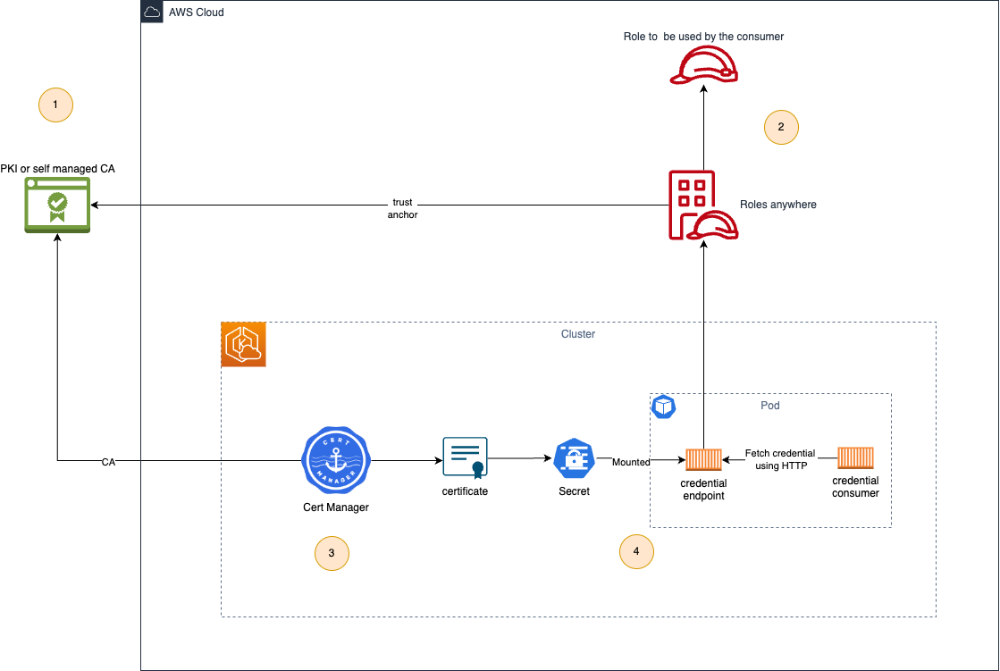

# IAM Roles Anywhere with Cert Manager and a self-managed CA

## Table of contents
* [Pre-requisite](#pre-requisite)
* [Description](#description)
* [Architecture](#architecture)
* [Walkthrough](#walkthrough)
* [Cleaning](#cleaning)
* [Video](#video)
* [Recommendations](#recommendations)

## Pre-requisite
Before going to the [Walkthrough](#walkthrough) section you  will need to install the following tool.
* openssl
* [kubectl](https://kubernetes.io/docs/reference/kubectl/)
* [aws CLI](https://aws.amazon.com/cli/)
* [eksctl](https://eksctl.io/)
* [helm](https://helm.sh/)
* You must configure a region

## Description
The  aim of this sample is to use AWS IAM Roles Anywhere  as credential for a running pod. This project is based on
* AWS IAM Rolesanywhere as credential provider
* self-managed CA as PKI
* [cert-manager](https://cert-manager.io/)


## Architecture

## Walkthrough
All commands  should be executed from the folder `cert-manager-self-managed-ca`

0. Deploy EKS cluster
    ```bash
    eksctl create cluster -f ./cluster.yaml 
    ```
1. Create the certificate authority

   1. Create a private key for the CA (for demonstration purpose)
       ```bash
       openssl genrsa -out rootCAKey.pem 2048 
       ```
   2. Create a certificate for the CA (for demonstration purpose)
       ```bash
       openssl req -x509 -sha256 -new -nodes -key rootCAKey.pem -days 3650 -out rootCACert.pem -extensions v3_ca -config openssl.cnf 
       ```
2. Deploy the AWS Roles Anywhere with the associated PKI
   ```bash
   CA_CERT=$(cat ./rootCACert.pem)
   aws cloudformation create-stack --stack-name rolesanywhere-sm-setup --parameters ParameterKey=X509CertificateData,ParameterValue=$CA_CERT --capabilities  CAPABILITY_IAM --template-body file://rolesanywhere-setup.yaml
   ```
3. Set up Cert Manager
   1. Add cert manager repository  to helm database
       ```bash
       helm repo add jetstack https://charts.jetstack.io
       ```
   2. Update helm database
       ```bash
       helm repo update
       ```
   3. Deploy cert manager
       ```bash
       kubectl apply -f https://github.com/cert-manager/cert-manager/releases/download/v1.12.0/cert-manager.crds.yaml
       ```
   4. Deploy cert manager
       ```bash
       helm install cert-manager jetstack/cert-manager --namespace cert-manager --create-namespace --version v1.12.0
       ```
4. Deploy certificates and pods
   1. Create the secret associated to the CA 
       ```bash
       kubectl create secret tls iamra-ca --key=./rootCAKey.pem --cert=./rootCACert.pem
       ```
   2. Set  environment variable
      ```bash
      export IAMRA_TRUST_ANCHOR_ARN=$(aws cloudformation describe-stacks --stack-name rolesanywhere-sm-setup --query 'Stacks[0].Outputs[?OutputKey==`TrustAnchorArn`] | [0].OutputValue' --output text)
      export IAMRA_PROFILE_ARN=$(aws cloudformation describe-stacks --stack-name rolesanywhere-sm-setup --query 'Stacks[0].Outputs[?OutputKey==`ProfileCAArn`] | [0].OutputValue' --output text)
      export IAMRA_ROLE_ARN=$(aws cloudformation describe-stacks --stack-name rolesanywhere-sm-setup --query 'Stacks[0].Outputs[?OutputKey==`RoleArn`] | [0].OutputValue' --output text)
      export IAMRA_AWS_SIGNER_REPO_URI=$(aws cloudformation describe-stacks --stack-name rolesanywhere-sm-setup --query 'Stacks[0].Outputs[?OutputKey==`AWSSignerHelperRepositoryUri`] | [0].OutputValue' --output text)
      export IAMRA_AWS_ECR_URI=$(aws cloudformation describe-stacks --stack-name rolesanywhere-sm-setup --query 'Stacks[0].Outputs[?OutputKey==`AWSEcrEndpointUri`] | [0].OutputValue' --output text)
      ```
   3. Build the image for running the credential endpoint
      ```bash
      aws ecr-public get-login-password --region us-east-1 | docker login --username AWS --password-stdin public.ecr.aws
      aws ecr get-login-password | docker login --username AWS --password-stdin $IAMRA_AWS_ECR_URI
      docker build --platform linux/amd64 -t $IAMRA_AWS_SIGNER_REPO_URI:v1 .
      docker push $IAMRA_AWS_SIGNER_REPO_URI:v1 
      ```
   4. Save environment variables to a file
      ```bash
      envsubst < environment.properties.tpl > environment.properties
      ```

   5. Deploy the pod
      ```bash
      kubectl apply -k .
      ```
   6. Test it
      ```bash
      kubectl logs iamra-self-managed-ca
      ```
## Cleaning
1. Delete the pod
    ```bash
    kubectl delete -k .
    ```
2. Delete Cert-manger
    ```bash
    helm uninstall -n cert-manager cert-manager
    kubectl delete -f https://github.com/cert-manager/cert-manager/releases/download/v1.12.0/cert-manager.crds.yaml
    ```
3. Delete AWS resources
    ```bash
    aws cloudformation delete-stack --stack-name rolesanywhere-sm-setup
    ```
4. Delete CA
    ```bash
    rm -f rootCA*.pem
    ```
5. Delete cluster
    ```bash
    eksctl delete cluster -f ./cluster.yaml
    ```


## Video
You can watch [this video](iamra-section1.mp4) for a live demonstration of the project.

## Recommendations
* Don't expose the  credentials behind a (Kubernetes) services or ingress
* Use subordinate CA instead of CA.
* Deploy the application in a dedicated namespace associated with RBAC with least privilege access
* Avoid the usage of the `root` user in your container
* Use a unique CA or subordinate CA for a given role.
* Use [certificate metadata  (Subject, CN, Issuer)  in the definition of the  trust relationship](https://docs.aws.amazon.com/rolesanywhere/latest/userguide/trust-model.html) of the IAM Role
* Apply least privilege access on the IAM Roles attached to IAM roles anywhere
* Use short-lived certificate.
* Generate AWS Credentials for a short period of time
* Set [Role max session duration](https://docs.aws.amazon.com/AWSCloudFormation/latest/UserGuide/aws-resource-iam-role.html#cfn-iam-role-maxsessionduration) to 1 hour maximum
* Set max session duration to a maximum 1 hour in AWS Roles Anywhere profile

