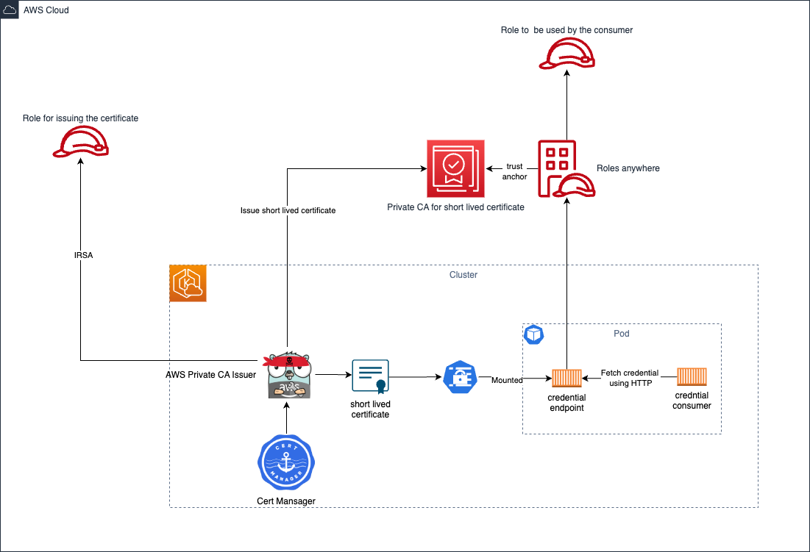

# IAM Roles Anywhere with Cert Manager

## Table of contents
* [Pre-requisite](#pre-requisite)
* [Description](#description)
* [Architecture](#architecture)
* [Walkthrough](#walkthrough)
* [Video](#video)
* [Discussion](#discussion)
* [Recommendations](#recommendations)

## Pre-requisite
Before going to the [Walkthrough](#walkthrough) section you  will need to install the following tool.
* openssl
* [kubectl](https://kubernetes.io/docs/reference/kubectl/)
* [aws CLI](https://aws.amazon.com/cli/)
* [eksctl](https://eksctl.io/)
* [helm](https://helm.sh/)
* You must configure a region

## Description
The  aim of this sample is to use AWS IAM Roles Anywhere  as credential for a running pod. This project is based on 
* AWS IAM Rolesanywhere as credential provider
* AWS PCA as PKI
* [cert-manager](https://cert-manager.io/)
* AWS PCA plugin for Cert Manager


## Architecture

## Walkthrough
All commands  should be executed from the folder `cert-manager`

1. Deploy EKS cluster
    ```bash
    eksctl create cluster -f ./cluster.yaml 
    ```

2. Deploy the AWS Roles Anywhere with the associated PKI
    ```bash
     aws cloudformation create-stack --stack-name acm-setup --capabilities  CAPABILITY_IAM --template-body file://rolesanywhere-setup.yaml
    ```

3. Create a role that will be used by the AWS PCA plugin for Cert Manager using IRSA
    ```bash
    eksctl create iamserviceaccount -f ./cluster.yaml --approve
    ```

4. Add cert manager repository  to helm database
    ```bash
    helm repo add jetstack https://charts.jetstack.io
    ```

5. Add aws pcs plugin repository  to helm database
    ```bash
    helm repo add awspca https://cert-manager.github.io/aws-privateca-issuer
    ```

6. Update helm database
    ```bash
    helm repo update
    ```

7. Deploy cert manager
    ```bash
    kubectl apply -f https://github.com/cert-manager/cert-manager/releases/download/v1.12.0/cert-manager.crds.yaml
    ```

8. Deploy cert manager
    ```bash
    helm install cert-manager jetstack/cert-manager --namespace cert-manager --create-namespace --version v1.12.0
    ```

9. Deploy AWS PCA plugin for cert-manager
    ```bash
    helm install awspca/aws-privateca-issuer --generate-name -f values.yaml
    ```

10. Set  environment variable
    ```bash
    export IAMRA_PCA_ARN=$(aws cloudformation describe-stacks --stack-name acm-setup --query 'Stacks[0].Outputs[?OutputKey==`ShortTermCAArn`] | [0].OutputValue' --output text)
    export IAMRA_TRUST_ANCHOR_ARN=$(aws cloudformation describe-stacks --stack-name acm-setup --query 'Stacks[0].Outputs[?OutputKey==`TrustAnchorArn`] | [0].OutputValue' --output text)
    export IAMRA_PROFILE_ARN=$(aws cloudformation describe-stacks --stack-name acm-setup --query 'Stacks[0].Outputs[?OutputKey==`ProfileCAArn`] | [0].OutputValue' --output text)
    export IAMRA_ROLE_ARN=$(aws cloudformation describe-stacks --stack-name acm-setup --query 'Stacks[0].Outputs[?OutputKey==`RoleArn`] | [0].OutputValue' --output text)
    export IAMRA_AWS_SIGNER_REPO_URI=$(aws cloudformation describe-stacks --stack-name acm-setup --query 'Stacks[0].Outputs[?OutputKey==`AWSSignerHelperRepositoryUri`] | [0].OutputValue' --output text)
    export IAMRA_AWS_ECR_URI=$(aws cloudformation describe-stacks --stack-name acm-setup --query 'Stacks[0].Outputs[?OutputKey==`AWSEcrEndpointUri`] | [0].OutputValue' --output text)
    ```
    
11. Build the image for running the credential endpoint
   ```bash
   aws ecr-public get-login-password --region us-east-1 | docker login --username AWS --password-stdin public.ecr.aws
   aws ecr get-login-password | docker login --username AWS --password-stdin $IAMRA_AWS_ECR_URI
   docker build --platform linux/amd64 -t $IAMRA_AWS_SIGNER_REPO_URI:v1 .
   docker push $IAMRA_AWS_SIGNER_REPO_URI:v1 
   ```

12. Save environment variables to a file
    ```bash
    envsubst < environment.properties.tpl > environment.properties
    ```

13. Deploy the pod
    ```bash
    kubectl apply -k .
    ```
    
14. Verify the role assumed by the credential consumer
    ```bash
    kubectl logs iamra-aws-pca 
    ```

## Video
You can watch [this video (i.e. section 1)](../cert-manager-self-managed-ca/iamra-section1.mp4) and [this video (i.e. section 2)](./iamra-section2.mp4) for a live demonstration of the project.
    
## Discussion
### Removing IRSA
In this first iteration the AWS plugin for Cert Manager require IRSA in order to issue new certificate. This can be an issue when this is deployed in Kubernetes cluster that are not managed by EKS.  There are 3 remediation
* Instead of using AWS PCA and the associated plugin we can use a self-signed certificate
* Instead of using AWS PCA and the associated plugin we can use spire/spiffe

## Recommendations
* Don't expose the  credentials behind a (Kubernetes) services or ingress
* Deploy the application in a dedicated namespace associated with RBAC with least privilege access
* Avoid the usage of the `root` user in your container
* Use [certificate metadata  (Subject, CN, Issuer)  in the definition of the  trust relationship](https://docs.aws.amazon.com/rolesanywhere/latest/userguide/trust-model.html) of the IAM Role
* Apply least privilege access on the IAM Roles attached to IAM roles anywhere
* Generate AWS Credentials for a short period of time
* Set [Role max session duration](https://docs.aws.amazon.com/AWSCloudFormation/latest/UserGuide/aws-resource-iam-role.html#cfn-iam-role-maxsessionduration) to 1 hour maximum
* Set max session duration to a maximum 1 hour in AWS Roles Anywhere profile

