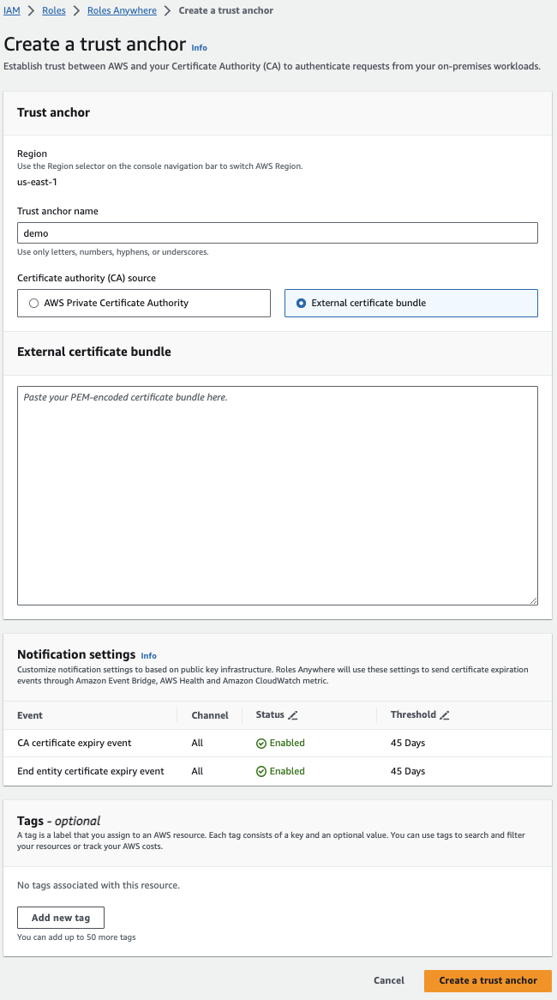
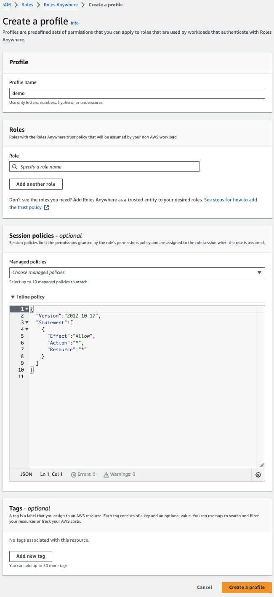

# IAM-RA Vault Certificate Authority

## Vault PKI Secrets Engine
https://developer.hashicorp.com/vault/docs/secrets/pki

## Configure Vault Certificate Authority

1. Enable and Configure the Vault PKI Engine:
```bash
vault secrets enable -path=pki-aws -description="aws pki" pki
```

```bash
vault secrets tune -max-lease-ttl=8760h pki-aws
```

2. Generate a root Certificate with Vault PKI:
```bash
vault write pki-aws/root/generate/internal \
      common_name=${VAULT_CERT_NAME} \
      ttl=8500h
```

The output should return a certificate and issuing certificate - *both* are required for establishing the IAM Roles Anywhere Trust Anchor:
```bash
Key              Value
---              -----
certificate      -----BEGIN CERTIFICATE-----
...
-----END CERTIFICATE-----
expiration       1725229904
issuer_id        7f27385d-17b3-8ff8-ec4d-14106bbd8a91
issuer_name      n/a

issuing_ca       -----BEGIN CERTIFICATE-----
...
-----END CERTIFICATE-----
key_id           4d4c47f8-57e5-4f9a-35e4-d8086b00d6d4
key_name         n/a
serial_number    37:b6:d8:ab:09:6f:6d:aa:68:a3:3b:2a:05:09:c2:0d:ed:7d:52:07
```


## IAM Roles Anywhere Configuration
1. Create the IAM-RA Trust Anchor; provide the CA Certificate created above:



2. Associate a Profile to the Trust Anchor:



3. For the IAM Role that will be assumed by IAM-RA (either existing or create new), establish a Trust Relationship for IAM-RA:
```json
{
    "Version": "2012-10-17",
    "Statement": [
        ...
        {
            "Effect": "Allow",
            "Principal": {
                "Service": "rolesanywhere.amazonaws.com"
            },
            "Action": [
                "sts:AssumeRole",
                "sts:TagSession",
                "sts:SetSourceIdentity"
            ]
        }
    ]
}
```

The permissions and associated IAM Policies do not impact the IAM-RA functionality but will determin what operations are available to the assumed role; these follow normal IAM considerations

4. For the IAM Role that will be assumed by IAM-RA, configure a `Trust relationship`:
```json
{
    "Version": "2012-10-17",
    "Statement": [
        ...
        {
            "Effect": "Allow",
            "Principal": {
                "Service": "rolesanywhere.amazonaws.com"
            },
            "Action": [
                "sts:AssumeRole",
                "sts:TagSession",
                "sts:SetSourceIdentity"
            ]
        }
    ]
}
```


## Certificate Management
1. Create a Vault Policy to extend permissions for generating Certificates
```bash
vault policy write iamanywhere-pki - <<EOF
path "pki-aws/*" {
  capabilities = ["list", "read"]
}
path "pki-aws/sign/${VAULT_CERT_CN}" {
  capabilities = ["create", "update"]
}
path "pki-aws/issue/${VAULT_CERT_CN}" {
  capabilities = ["create", "update"]
}
EOF
```

2. Setup the PKI Role (the name of this role is arbitrary and need not be consistent with other names; `demo` is used here):
```bash
vault write pki-aws/roles/demo \
      allowed_domains=${VAULT_CERT_CN} \
      allow_bare_domains=true \
      allow_subdomains=true
```

3. Add the new Policy to the `iamanywhere` role, this will link the permissions for Certificates above to the Kubernetes authentication method `ServiceAccount`:
```bash
vault write auth/kubernetes/role/iamanywhere \
    bound_service_account_names=${VAULT_SERVICE_ACCOUNT} \
    bound_service_account_namespaces=frontend,backend \
    policies=default,iamanywhere,iamanywhere-pki \
    ttl=1h
```
note: Permissions could be added to an existing policy and inherited by the role, however, it is recommended to follow a single-use strategy for Vault Policies

4. Create Kubernetes `Secret` resources that include the AWS ARN values from the Trust Anchor, Trust Profile, and IAM Role:
```bash
vault kv put secret/iamanywhere/profile-arn arn='arn:aws:...' && \
vault kv put secret/iamanywhere/anchor-arn arn='arn:aws:...' && \
vault kv put secret/iamanywhere/role-arn arn='arn:aws:...'
```
These ARN's come from IAM and IAM-RA respectively and will be used by the helper script (executed during Pod init) to assume appropriate IAM permissions.

5. Create ARN `VaultStaticSecret` resources that will link the above Vault secrets into Kubernetes `Secret` resources; this consumes the Vault secretes created in step 4 to create Kubernetes secrets from the provided ARNs:
```bash
cat <<EOF | kubectl create --save-config=true --filename -
---
apiVersion: secrets.hashicorp.com/v1beta1
kind: VaultStaticSecret
metadata:
  name: anchor-arn
  namespace: frontend
spec:
  type: kv-v1
  mount: secret
  path: iamanywhere/anchor-arn
  destination:
    name: anchor-arn
    create: true
  refreshAfter: 30s
  vaultAuthRef: static-auth
---
apiVersion: secrets.hashicorp.com/v1beta1
kind: VaultStaticSecret
metadata:
  name: profile-arn
  namespace: frontend
spec:
  type: kv-v1
  mount: secret
  path: iamanywhere/profile-arn
  destination:
    name: profile-arn
    create: true
  refreshAfter: 30s
  vaultAuthRef: static-auth
---
apiVersion: secrets.hashicorp.com/v1beta1
kind: VaultStaticSecret
metadata:
  name: role-arn
  namespace: frontend
spec:
  type: kv-v1
  mount: secret
  path: iamanywhere/role-arn
  destination:
    name: role-arn
    create: true
  refreshAfter: 30s
  vaultAuthRef: static-auth
EOF
```

## Verify the Configuration
1. Launch a test Pod using the image build earlier (this will closely resemble the configuration used for all Pods):
```yaml
cat <<EOF | kubectl create --save-config=true --filename -
---
apiVersion: v1
kind: Pod
metadata:
  labels:
    app: demo
  name: demo
  namespace: frontend
spec:
  containers:
  - name: aws-iam-ra
    args:
    - while true; do sleep 30; done;
    command:
    - /bin/bash
    - -c
    - --
    env:
    - name: VAULT_ADDR
      value: http://vault.vault.svc.cluster.local:8200
    - name: VAULT_ROLE
      value: iamanywhere
    - name: VAULT_CERT_NAME
      value: ${VAULT_CERT_CN}
    - name: VAULT_CERT_CN
      value: ${VAULT_CERT_CN}
    - name: ROLE_ARN
      valueFrom:
        secretKeyRef:
          key: arn
          name: role-arn
    - name: ANCHOR_ARN
      valueFrom:
        secretKeyRef:
          key: arn
          name: anchor-arn
    - name: PROFILE_ARN
      valueFrom:
        secretKeyRef:
          key: arn
          name: profile-arn
    image: ${ACCOUNT_NUMBER}.dkr.ecr.${REGION}.amazonaws.com/iamra:${IMAGE_TAG}
    imagePullPolicy: Always
    securityContext:
      runAsUser: 65534
  serviceAccount: ${VAULT_SERVICE_ACCOUNT}
  serviceAccountName: ${VAULT_SERVICE_ACCOUNT}
EOF
```
This test Pod will be used (below) to validate that all of the metadata is correctly tied together in order to produce IAM credentials.

2. Generate an SSL Certificate from Vault:
```bash
kubectl --namespace frontend exec -it \
  $(kubectl --namespace frontend get po \
    --selector='app=demo' \
    --template '{{range .items}}{{.metadata.name}}{{"\n"}}{{end}}'\
  ) \
    -- /bin/bash

```

Execute the Python script:
```bash
python3 gen-cert.py
```

3. Using the Certificate, request IAM Credentials from AW:
```bash
./aws_signing_helper credential-process \
  --certificate cert.pem \
  --private-key private.pem \
  --intermediates chain.pem \
  --trust-anchor-arn $ANCHOR_ARN \
  --profile-arn $PROFILE_ARN \
  --role-arn $ROLE_ARN
```
This should return a JSON dictionary of credentials:
```json
{
  "Version": 1,
  "AccessKeyId": "xxxx",
  "SecretAccessKey": "xxxx",
  "SessionToken": "xxxx",
  "Expiration": "2023-09-15T19:24:04Z"
}
```
